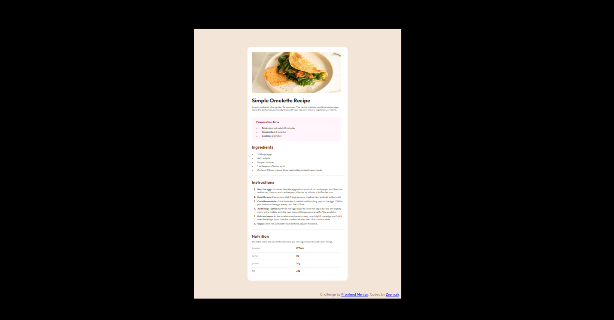
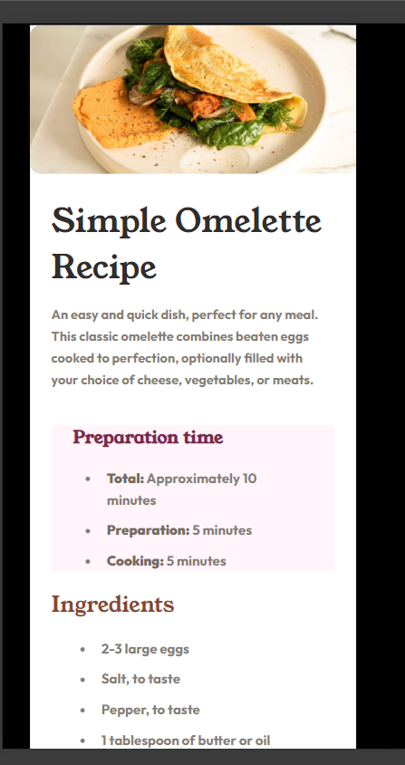

# Frontend Mentor - Recipe page solution

This is a solution to the [Recipe page challenge on Frontend Mentor](https://www.frontendmentor.io/challenges/recipe-page-KiTsR8QQKm). 

### Screenshots
|||

### Links

- Solution URL: [https://github.com/Z3emah/recipe-page-main](https://github.com/Z3emah/recipe-page-main)
- Live Site URL: [https://z3emah.github.io/recipe-page-main](https://z3emah.github.io/recipe-page-main)

### Built with

- Semantic HTML5 markup
- CSS custom properties
- Flexbox

## Author
- Frontend Mentor - [@Z3emah](https://www.frontendmentor.io/profile/yourusername)
